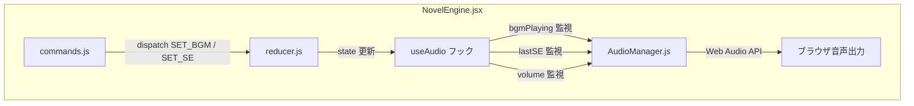

# 設計書: 音声システム（BGM / SE）

> 対象: E-010, E-011, U-004

## 1. 概要

ゲーム中の BGM ループ再生と SE ワンショット再生を管理する。
Web Audio API をベースとし、外部ライブラリへの依存を避ける。

---

## 2. アーキテクチャ



---

## 3. ファイル構成

| ファイル | 役割 |
|---------|------|
| `src/audio/AudioManager.js` | Web Audio API ラッパークラス |
| `src/audio/useAudio.js` | React Hook（エンジンとの接続） |
| `src/components/ConfigView.jsx` | 音量スライダー追加（既存ファイル修正） |
| `src/engine/commands.js` | `bgm_stop` コマンド追加（既存ファイル修正） |
| `src/engine/constants.js` | `BGM_STOP` 定数追加（既存ファイル修正） |
| `src/engine/reducer.js` | 音量ステート追加（既存ファイル修正） |

---

## 4. AudioManager クラス設計

### 4.1 プロパティ

```js
class AudioManager {
  constructor() {
    this.ctx = null;           // AudioContext（遅延初期化）
    this.bgmSource = null;     // 現在の BGM AudioBufferSourceNode
    this.bgmGain = null;       // BGM GainNode
    this.seGain = null;        // SE GainNode
    this.masterGain = null;    // マスター GainNode
    this.bgmBuffer = null;     // 現在ロード済み BGM AudioBuffer
    this.bgmName = null;       // 現在再生中の BGM 名
    this.cache = new Map();    // AudioBuffer キャッシュ { name → AudioBuffer }
    this.volumes = {
      master: 1.0,
      bgm: 0.8,
      se: 1.0,
    };
  }
}
```

### 4.2 メソッド

```js
// AudioContext の遅延初期化（ユーザー操作後に呼ぶ）
init()

// BGM 再生
// - 同じ曲が再生中なら何もしない
// - 別の曲が再生中ならクロスフェード
async playBGM(name, { volume = 0.8, loop = true, fadeIn = 500 } = {})

// BGM 停止
async stopBGM({ fadeOut = 1000 } = {})

// SE 再生（ワンショット）
async playSE(name, { volume = 1.0 } = {})

// 音量設定
setVolume(type, value)   // type: "master" | "bgm" | "se", value: 0.0-1.0

// リソース解放
dispose()

// --- 内部メソッド ---
async _loadAudio(name, type)   // type: "bgm" | "se"
_resolveAssetPath(name, type)  // → "assets/bgm/{name}.ogg"
_fadeGain(gainNode, from, to, duration)  // GainNode のフェード
```

### 4.3 アセット解決

```js
_resolveAssetPath(name, type) {
  // Electron: process.resourcesPath + "/assets/{type}/{name}.ogg"
  // ブラウザ: "./assets/{type}/{name}.ogg"
  // 拡張子なしの name を受け取り、.ogg → .mp3 の順で試行
}
```

### 4.4 エラーハンドリング

- ファイルが見つからない場合: コンソール警告のみ、ゲーム進行は止めない
- AudioContext が未初期化の場合: 初回クリック時に `init()` を自動呼出し
- デコードエラー: コンソール警告 + スキップ

---

## 5. useAudio フック設計

```jsx
function useAudio(state, dispatch) {
  const managerRef = useRef(null);

  // 初期化（初回クリック時）
  useEffect(() => {
    const manager = new AudioManager();
    managerRef.current = manager;

    const initOnClick = () => {
      manager.init();
      document.removeEventListener("click", initOnClick);
    };
    document.addEventListener("click", initOnClick);

    return () => manager.dispose();
  }, []);

  // BGM 変更監視
  useEffect(() => {
    if (!managerRef.current) return;
    if (state.bgmPlaying) {
      managerRef.current.playBGM(state.bgmPlaying);
    } else {
      managerRef.current.stopBGM();
    }
  }, [state.bgmPlaying]);

  // SE 変更監視
  useEffect(() => {
    if (!managerRef.current || !state.lastSE) return;
    managerRef.current.playSE(state.lastSE);
  }, [state.lastSE]);

  // 音量変更監視
  useEffect(() => {
    if (!managerRef.current) return;
    managerRef.current.setVolume("master", state.volumeMaster);
    managerRef.current.setVolume("bgm", state.volumeBGM);
    managerRef.current.setVolume("se", state.volumeSE);
  }, [state.volumeMaster, state.volumeBGM, state.volumeSE]);

  return managerRef;
}
```

---

## 6. ステート追加

### reducer.js に追加するステート

```js
// initialState に追加
volumeMaster: 1.0,
volumeBGM: 0.8,
volumeSE: 1.0,

// アクション追加
case "SET_VOLUME_MASTER":
  return { ...state, volumeMaster: action.payload };
case "SET_VOLUME_BGM":
  return { ...state, volumeBGM: action.payload };
case "SET_VOLUME_SE":
  return { ...state, volumeSE: action.payload };
case "STOP_BGM":
  return { ...state, bgmPlaying: null };
```

### constants.js に追加

```js
export const CMD = {
  // ... 既存
  BGM_STOP: "bgm_stop",
};

export const ACTION = {
  // ... 既存
  SET_VOLUME_MASTER: "SET_VOLUME_MASTER",
  SET_VOLUME_BGM: "SET_VOLUME_BGM",
  SET_VOLUME_SE: "SET_VOLUME_SE",
  STOP_BGM: "STOP_BGM",
};
```

---

## 7. commands.js 変更

```js
case CMD.BGM_STOP:
  dispatch({ type: ACTION.STOP_BGM });
  break;
```

---

## 8. ConfigView.jsx 音量スライダー追加

```jsx
// テキスト速度スライダーの下に追加
<VolumeSlider label="マスター音量" value={state.volumeMaster}
  onChange={(v) => dispatch({ type: "SET_VOLUME_MASTER", payload: v })} />
<VolumeSlider label="BGM 音量" value={state.volumeBGM}
  onChange={(v) => dispatch({ type: "SET_VOLUME_BGM", payload: v })} />
<VolumeSlider label="SE 音量" value={state.volumeSE}
  onChange={(v) => dispatch({ type: "SET_VOLUME_SE", payload: v })} />
```

スライダー仕様:
- range input, min=0, max=100, step=5
- 表示: 0〜100%
- 値: 0.0〜1.0 に変換して dispatch

---

## 9. 対応フォーマット

| 形式 | 用途 | 備考 |
|------|------|------|
| `.ogg` | 推奨 | Electron/Chrome で対応 |
| `.mp3` | フォールバック | ライセンス不要 |

### ファイル配置

```
assets/
  bgm/
    morning_theme.ogg
    battle_theme.ogg
  se/
    click.ogg
    chime.ogg
    explosion.ogg
```

---

## 10. テスト観点

- [ ] BGM がループ再生されること
- [ ] BGM 切り替え時にクロスフェードすること
- [ ] BGM 停止時にフェードアウトすること
- [ ] SE がワンショット再生されること
- [ ] 複数 SE を同時再生できること
- [ ] 音量スライダーがリアルタイムで反映されること
- [ ] ファイル未存在時にエラーで止まらないこと
- [ ] ブラウザの autoplay policy でブロックされないこと（クリック後に初期化）
- [ ] Electron 環境でアセットパスが正しく解決されること
