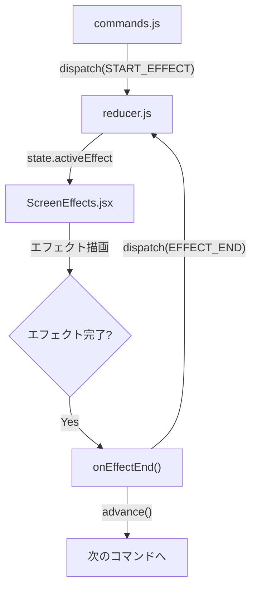

# 設計書: 画面エフェクト

> 対象: E-012

## 1. 概要

ゲーム中の演出として画面エフェクト（揺れ、フラッシュ、暗転など）を提供する。
CSS animation ベースで実装し、コマンド完了後に自動で次のスクリプトへ進む。

---

## 2. エフェクト一覧

| name | 説明 | デフォルト |
|------|------|-----------|
| `shake` | 画面揺れ | intensity: 8px, time: 500ms |
| `flash` | 画面フラッシュ | color: #fff, time: 300ms |
| `fadeout` | フェードアウト（暗転） | color: #000, time: 1000ms |
| `fadein` | フェードイン（暗転解除） | time: 1000ms |
| `whitefade` | ホワイトアウト | time: 1000ms |

---

## 3. アーキテクチャ



---

## 4. ファイル構成

| ファイル | 変更種別 | 内容 |
|---------|---------|------|
| `src/effects/ScreenEffects.jsx` | 新規 | エフェクト描画コンポーネント |
| `src/engine/NovelEngine.jsx` | 修正 | ScreenEffects 配置 + onEffectEnd コールバック |
| `src/engine/reducer.js` | 修正 | activeEffect ステート追加 |
| `src/engine/commands.js` | 修正 | effect コマンド処理追加 |
| `src/engine/constants.js` | 修正 | EFFECT 定数追加 |

---

## 5. ステート設計

### reducer.js

```js
// initialState に追加
activeEffect: null,
// { name: "shake", color: "#fff", time: 500, intensity: 8 }

// アクション追加
case "START_EFFECT":
  return { ...state, activeEffect: action.payload };
case "EFFECT_END":
  return { ...state, activeEffect: null };
```

---

## 6. commands.js 変更

```js
case CMD.EFFECT:
  dispatch({
    type: ACTION.START_EFFECT,
    payload: {
      name: cmd.name,
      color: cmd.color,
      time: cmd.time,
      intensity: cmd.intensity,
    },
  });
  // ★ effect は非同期コマンド。ここでループを中断して
  // ScreenEffects の onEffectEnd で advance() を呼ぶ
  return i;  // 現在の index を返してループ中断
```

**重要**: `effect` コマンドは `dialog` / `choice` と同様に processCommand ループを中断する。
エフェクト完了後に `onEffectEnd` → `advance()` で次に進む。

---

## 7. ScreenEffects.jsx 設計

```jsx
import { useEffect, useState } from "react";

export default function ScreenEffects({ effect, onEffectEnd, containerRef }) {
  const [style, setStyle] = useState({});

  useEffect(() => {
    if (!effect) return;

    const time = effect.time || getDefaultTime(effect.name);
    let timer;
    let animFrame;

    switch (effect.name) {
      case "shake":
        runShake(containerRef, effect.intensity || 8, time, () => onEffectEnd());
        break;
      case "flash":
        setStyle(flashStyle(effect.color || "#fff"));
        timer = setTimeout(() => {
          setStyle({});
          onEffectEnd();
        }, time);
        break;
      case "fadeout":
        setStyle(fadeoutStyle(effect.color || "#000", time));
        timer = setTimeout(() => onEffectEnd(), time);
        // fadeout 後はオーバーレイを維持（fadein で解除）
        break;
      case "fadein":
        setStyle(fadeinStyle(time));
        timer = setTimeout(() => {
          setStyle({});
          onEffectEnd();
        }, time);
        break;
      case "whitefade":
        setStyle(fadeoutStyle("#fff", time));
        timer = setTimeout(() => onEffectEnd(), time);
        break;
    }

    return () => {
      clearTimeout(timer);
      cancelAnimationFrame(animFrame);
    };
  }, [effect]);

  if (!effect) return null;

  return (
    <div style={{
      position: "absolute", inset: 0, zIndex: 50,
      pointerEvents: "none",
      ...style,
    }} />
  );
}
```

---

## 8. 各エフェクトの実装詳細

### 8.1 shake（画面揺れ）

- **方式**: ゲームコンテナの `transform` を直接操作
- **アルゴリズム**: requestAnimationFrame ループで `translateX/Y` をランダムに振動
- **減衰**: 時間経過で振幅を線形に減衰（intensity → 0）
- **完了後**: transform をリセット

```js
function runShake(containerRef, intensity, duration, onEnd) {
  const el = containerRef.current;
  const start = performance.now();

  function frame(now) {
    const elapsed = now - start;
    if (elapsed >= duration) {
      el.style.transform = "";
      onEnd();
      return;
    }
    const progress = 1 - elapsed / duration;  // 1→0 減衰
    const x = (Math.random() - 0.5) * 2 * intensity * progress;
    const y = (Math.random() - 0.5) * 2 * intensity * progress;
    el.style.transform = `translate(${x}px, ${y}px)`;
    requestAnimationFrame(frame);
  }
  requestAnimationFrame(frame);
}
```

### 8.2 flash（フラッシュ）

- **方式**: オーバーレイ div の opacity を 1→0 に遷移
- **スタイル**:
  ```js
  { background: color, opacity: 1, transition: `opacity ${time}ms ease-out` }
  ```
- **50ms 後に opacity: 0 を設定**（CSS transition が走る）

### 8.3 fadeout（暗転）

- **方式**: オーバーレイ div の opacity を 0→1 に遷移
- **スタイル**:
  ```js
  { background: color, opacity: 0, transition: `opacity ${time}ms ease-in` }
  ```
- **即座に opacity: 1 に変更**
- **完了後もオーバーレイ維持**（fadein まで暗転状態を保持）

### 8.4 fadein（暗転解除）

- **方式**: 現在のオーバーレイ opacity を 1→0 に遷移
- **前提**: fadeout で作られたオーバーレイが存在する
- **完了後**: オーバーレイを除去

### 8.5 whitefade（ホワイトアウト）

- **fadeout と同じロジック**。`color: "#fff"` 固定。

---

## 9. エフェクト → advance 連携フロー

```
1. processCommand() で effect コマンドに到達
2. dispatch(START_EFFECT) → state.activeEffect にセット
3. processCommand() はここでループ中断（return i）
4. dispatch(SET_SCRIPT_INDEX) で現在位置を更新
5. ScreenEffects がマウントされ、エフェクト実行
6. エフェクト完了 → onEffectEnd() 呼出
7. onEffectEnd 内で advance() を呼び、次のコマンドへ
```

---

## 10. fadeout 状態の持続

fadeout / whitefade は完了後もオーバーレイを維持する必要がある。

```js
// reducer.js
case "EFFECT_END":
  // fadeout / whitefade の場合はオーバーレイを残す
  if (state.activeEffect?.name === "fadeout" || state.activeEffect?.name === "whitefade") {
    return {
      ...state,
      activeEffect: null,
      screenOverlay: { color: state.activeEffect.color || "#000", opacity: 1 },
    };
  }
  return { ...state, activeEffect: null, screenOverlay: null };

case "START_EFFECT":
  // fadein 開始時にオーバーレイ情報を引き継ぐ
  if (action.payload.name === "fadein") {
    return { ...state, activeEffect: { ...action.payload, fromOverlay: state.screenOverlay } };
  }
  return { ...state, activeEffect: action.payload };
```

---

## 11. テスト観点

- [ ] shake: 画面が揺れて元に戻ること
- [ ] shake: intensity で揺れ幅が変わること
- [ ] flash: 指定色でフラッシュして消えること
- [ ] fadeout: 暗転して暗転状態が維持されること
- [ ] fadein: 暗転が解除されること
- [ ] fadeout → fadein のシーケンスが正しく動作すること
- [ ] whitefade: 白で暗転すること
- [ ] エフェクト完了後に自動で次のコマンドへ進むこと
- [ ] エフェクト中にクリックしても問題ないこと
- [ ] time パラメータで持続時間が変わること
