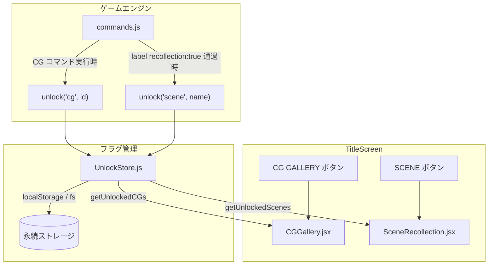
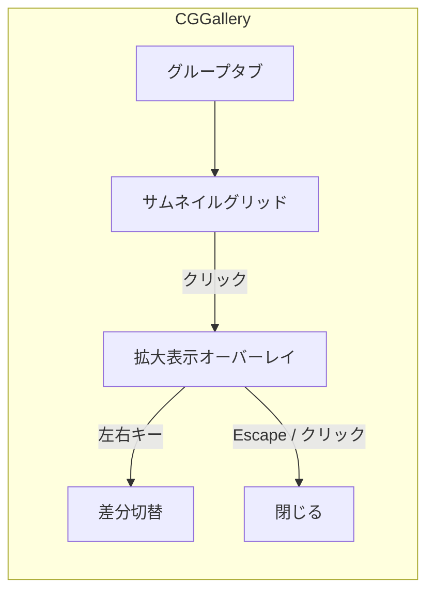
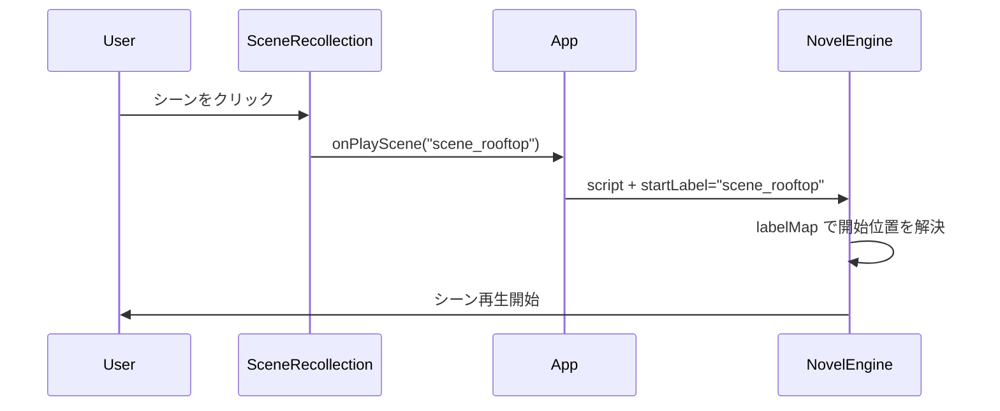

# 設計書: CG ギャラリー / シーン回想

> 対象: U-006, U-007

## 1. 概要

ゲーム中に解放したイベント CG やシーンを、タイトル画面から閲覧・再プレイできる。
フラグ管理により、未解放のコンテンツはシルエット表示にする。

---

## 2. アーキテクチャ



---

## 3. ファイル構成

| ファイル | 変更種別 | 内容 |
|---------|---------|------|
| `src/components/CGGallery.jsx` | 新規 | CG 一覧 + 拡大表示 |
| `src/components/SceneRecollection.jsx` | 新規 | シーン一覧 + 再プレイ |
| `src/save/UnlockStore.js` | 新規 | フラグ永続化 |
| `src/engine/commands.js` | 修正 | CG 解放フラグ登録 |
| `src/components/TitleScreen.jsx` | 修正 | ボタン接続 |
| `src/data/cg-catalog.js` | 新規 | CG 定義マスタ |
| `src/data/scene-catalog.js` | 新規 | シーン定義マスタ |

---

## 4. データ定義

### 4.1 CG カタログ

```js
// src/data/cg-catalog.js
const CG_CATALOG = [
  {
    id: "ev_01",
    title: "屋上の告白",
    src: "cg/ev_01.png",           // assets/ 相対パス
    thumbnail: "cg/ev_01_thumb.png",
    group: "chapter1",             // グループ分け
    variants: ["ev_01", "ev_01b"], // 差分 CG（表情違い等）
  },
];
export default CG_CATALOG;
```

### 4.2 シーンカタログ

```js
// src/data/scene-catalog.js
const SCENE_CATALOG = [
  {
    name: "scene_rooftop",   // label name と一致
    title: "屋上の告白",
    chapter: "第1章",
    thumbnail: "cg/ev_01_thumb.png",
  },
];
export default SCENE_CATALOG;
```

---

## 5. UnlockStore 設計

```js
// src/save/UnlockStore.js
const STORAGE_KEY = "doujin-engine-unlocks";

export function getUnlocks() {
  const raw = localStorage.getItem(STORAGE_KEY);
  return raw ? JSON.parse(raw) : { cg: [], scene: [] };
}

export function unlock(type, id) {
  const data = getUnlocks();
  if (!data[type].includes(id)) {
    data[type].push(id);
    localStorage.setItem(STORAGE_KEY, JSON.stringify(data));
  }
}

export function isUnlocked(type, id) {
  return getUnlocks()[type].includes(id);
}

export function unlockAll(catalog, type) {
  const data = getUnlocks();
  data[type] = catalog.map((item) => item.id || item.name);
  localStorage.setItem(STORAGE_KEY, JSON.stringify(data));
}

export function resetUnlocks() {
  localStorage.removeItem(STORAGE_KEY);
}
```

---

## 6. CGGallery.jsx 設計

### 6.1 画面レイアウト



### 6.2 表示ルール

| 状態 | 表示 |
|------|------|
| 解放済み | サムネイル画像 |
| 未解放 | グレーシルエット + 「？」アイコン |

---

## 7. SceneRecollection.jsx 設計

### 7.1 再プレイフロー



---

## 8. エンジン側の解放トリガー

### 8.1 CG 解放（新コマンド）

```js
{ type: "cg", id: "ev_01", src: "cg/ev_01.png" }
```

処理:
1. 画面にイベント CG を全画面表示
2. `unlock("cg", cmd.id)` でフラグ保存
3. クリックで CG を閉じて次のコマンドへ

### 8.2 シーン解放

```js
// commands.js
case CMD.LABEL:
  if (cmd.recollection) {
    unlock("scene", cmd.name);
  }
  break;
```

---

## 9. テスト観点

- [ ] 未解放 CG がシルエット表示されること
- [ ] CG コマンド実行後に解放フラグが立つこと
- [ ] 解放済み CG のサムネイルが表示されること
- [ ] 拡大表示で差分切替ができること
- [ ] シーン回想で指定ラベルから再生開始すること
- [ ] recollection ラベル通過でシーンが解放されること
- [ ] 解放データがリロード後も永続化していること
