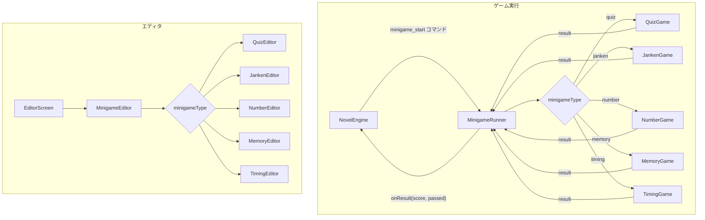
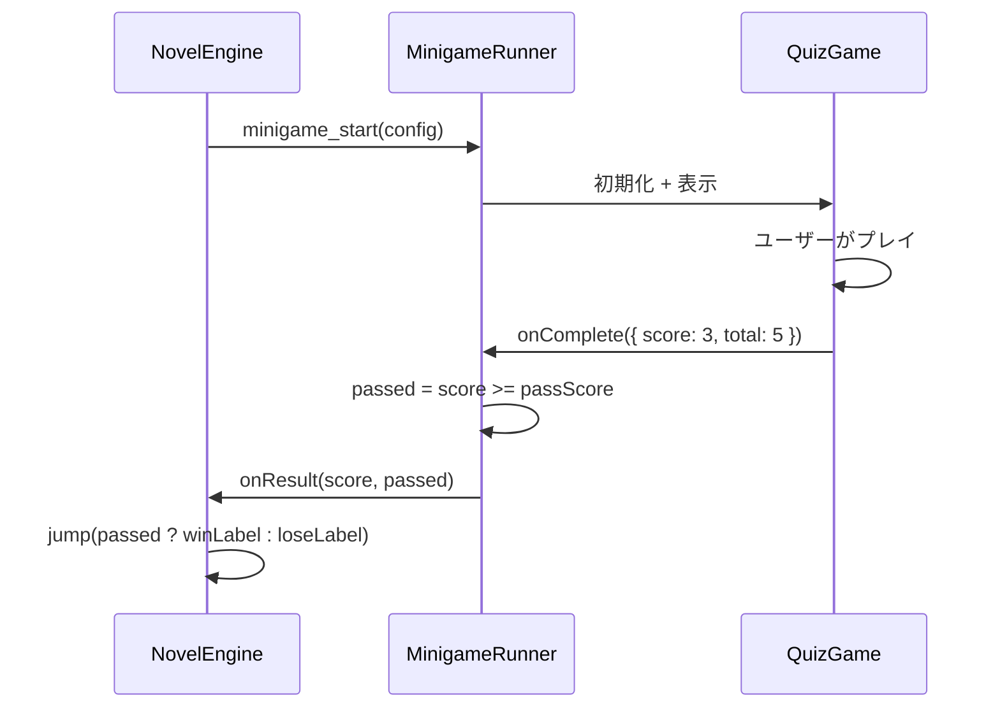

# 設計書: ミニゲームシステム

> 対象: ミニゲームエディタ / ランタイム

## 1. 概要

ノベルゲーム中に挿入可能なミニゲームをテンプレートベースで提供する。
エディタで設定を変更するだけでオリジナルのミニゲームを作成できる。

---

## 2. ミニゲーム種類

| id | 名称 | 説明 |
|----|------|------|
| `quiz` | クイズ | 4択問題 × N問。正答率で分岐 |
| `janken` | じゃんけん | NPC とじゃんけん。勝敗で分岐 |
| `number` | 数当て | 1〜100 の数字を当てる |
| `memory` | 神経衰弱 | カードめくり。制限時間内にペア完成 |
| `timing` | タイミング | ゲージが動き、ボタンで止める |

---

## 3. アーキテクチャ



---

## 4. 統合コマンド

### 4.1 ノベルスクリプトからの呼び出し

```js
{
  type: "minigame_start",
  minigameType: "quiz",
  config: {
    questions: [
      { q: "日本の首都は？", choices: ["東京", "大阪", "京都", "名古屋"], answer: 0 },
    ],
    passScore: 2,
    timeLimit: 30,
  },
  winLabel: "quiz_win",
  loseLabel: "quiz_lose",
}
```

### 4.2 結果処理フロー



---

## 5. 各ミニゲーム仕様

### 5.1 QuizGame

| パラメータ | 型 | 説明 |
|-----------|-----|------|
| questions | array | 問題配列 `{ q, choices[], answer }` |
| passScore | number | 合格ライン |
| timeLimit | number | 制限時間（秒） |
| showResult | boolean | 問題ごとに正誤表示 |

### 5.2 JankenGame

| パラメータ | 型 | 説明 |
|-----------|-----|------|
| rounds | number | 勝負回数 |
| winRequired | number | 必要勝利数 |
| npcPattern | string | NPC のパターン（"random" / "biased_rock" 等） |
| npcName | string | 相手の名前 |

### 5.3 NumberGame

| パラメータ | 型 | 説明 |
|-----------|-----|------|
| min | number | 最小値 |
| max | number | 最大値 |
| maxGuesses | number | 最大回数 |

### 5.4 MemoryGame

| パラメータ | 型 | 説明 |
|-----------|-----|------|
| pairs | number | ペア数（4〜12） |
| timeLimit | number | 制限時間（秒） |
| cardImages | array | カード画像パス（null でデフォルト絵文字） |

### 5.5 TimingGame

| パラメータ | 型 | 説明 |
|-----------|-----|------|
| speed | number | ゲージ速度（px/frame） |
| targetZone | object | `{ start: 0.4, end: 0.6 }` ターゲット範囲 |
| attempts | number | 試行回数 |
| passRequired | number | 成功必要数 |

---

## 6. MinigameRunner コンポーネント

```jsx
export default function MinigameRunner({ type, config, onResult }) {
  const GameComponent = GAME_COMPONENTS[type];
  if (!GameComponent) {
    onResult({ score: 0, passed: false });
    return null;
  }
  return (
    <div style={{ position: "absolute", inset: 0, zIndex: 60, background: "rgba(0,0,0,0.9)" }}>
      <GameComponent
        config={config}
        onComplete={(result) => {
          const passed = result.score >= (config.passScore || 1);
          onResult({ ...result, passed });
        }}
      />
    </div>
  );
}
```

---

## 7. ファイル構成

| ファイル | 内容 |
|---------|------|
| `src/minigame/MinigameRunner.jsx` | ディスパッチャー |
| `src/minigame/QuizGame.jsx` | クイズ |
| `src/minigame/JankenGame.jsx` | じゃんけん |
| `src/minigame/NumberGame.jsx` | 数当て |
| `src/minigame/MemoryGame.jsx` | 神経衰弱 |
| `src/minigame/TimingGame.jsx` | タイミング |
| `src/editor/minigame/MinigameEditor.jsx` | エディタ（ひな形実装済み） |

---

## 8. テスト観点

- [ ] 各ミニゲームが起動・終了すること
- [ ] スコアが正しく計算されること
- [ ] passScore による合格 / 不合格判定が正しいこと
- [ ] winLabel / loseLabel へのジャンプが正しく動作すること
- [ ] 制限時間切れで自動終了すること
- [ ] ミニゲーム中にノベルエンジンの入力が干渉しないこと
- [ ] エディタで設定を変更してプレビューできること
