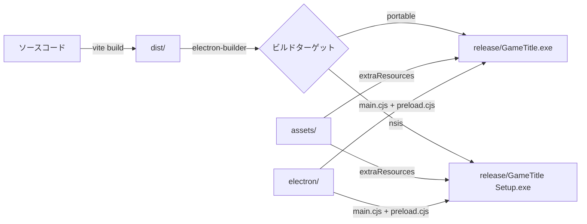
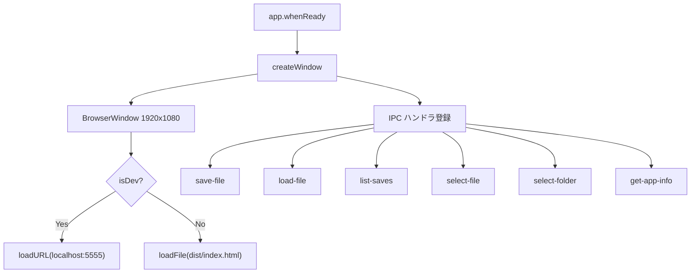
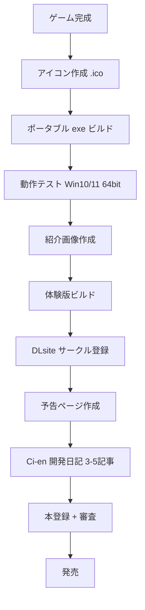

# 設計書: パッケージング / 配布

> 対象: Electron ビルド, DLsite 出品

## 1. 概要

Doujin Engine で制作したゲームを Windows exe にパッケージングし、
DLsite で配布する。asar による素材保護、アイコン設定、インストーラ構成を含む。

---

## 2. ビルドフロー



---

## 3. ビルドコマンド

| コマンド | 出力 |
|---------|------|
| `npm run build` | `dist/` (Web) |
| `npm run electron:portable` | `release/` (ポータブル exe) |
| `npm run electron:build` | `release/` (NSIS + ポータブル) |

---

## 4. Electron メインプロセス

### 4.1 main.cjs 構成



### 4.2 preload.cjs API

```js
contextBridge.exposeInMainWorld("electronAPI", {
  saveFile:     (path, data) => ipcRenderer.invoke("save-file", path, data),
  loadFile:     (path) => ipcRenderer.invoke("load-file", path),
  listSaves:    (dir) => ipcRenderer.invoke("list-saves", dir),
  selectFile:   (opts) => ipcRenderer.invoke("select-file", opts),
  selectFolder: () => ipcRenderer.invoke("select-folder"),
  getAppInfo:   () => ipcRenderer.invoke("get-app-info"),
});
```

---

## 5. アセット管理

### 5.1 ディレクトリ構成

```
assets/
├── icon.ico          ← アプリアイコン（256x256）
├── bg/               ← 背景画像
├── chara/            ← 立ち絵 (.png 透過)
├── cg/               ← イベント CG
├── bgm/              ← BGM (.ogg)
├── se/               ← SE (.ogg)
├── tileset/          ← RPG タイルセット
├── ui/               ← UI 素材
└── font/             ← フォント
```

### 5.2 アセットパス解決

```js
function resolveAssetPath(relativePath) {
  if (window.electronAPI) {
    return `../assets/${relativePath}`;  // extraResources
  }
  return `./assets/${relativePath}`;     // ブラウザ
}
```

### 5.3 asar

- `dist/` と `electron/` は asar に格納
- `assets/` は extraResources で asar 外に配置

---

## 6. DLsite 配布準備

### 6.1 チェックリスト



### 6.2 紹介画像

| 種類 | サイズ | 用途 |
|------|--------|------|
| メイン | 600x420px | 作品ページトップ |
| サブ 1-4 | 任意 | スクリーンショット |

### 6.3 配布 ZIP 構成

```
GameTitle/
├── GameTitle.exe
├── assets/
├── resources/
└── README.txt
```

### 6.4 体験版の作り方

1. スクリプトを途中まで（第1章のみ等）に切り詰める
2. 最後に `{ type: "dialog", text: "体験版はここまでです..." }` を追加
3. 同じビルドフローで exe を生成
4. ファイル名に `_trial` を付けて区別

---

## 7. テスト観点

- [ ] `npm run electron:portable` で exe が生成されること
- [ ] 生成された exe をダブルクリックで起動できること
- [ ] assets/ 内の画像・音声が正しく読み込まれること
- [ ] セーブ/ロードが Electron 環境で動作すること
- [ ] F11 でフルスクリーン切替ができること
- [ ] asar パッケージング後も正常動作すること
- [ ] icon.ico がタスクバー・タイトルバーに表示されること
- [ ] 未インストール環境の Win10/11 64bit で動作すること
