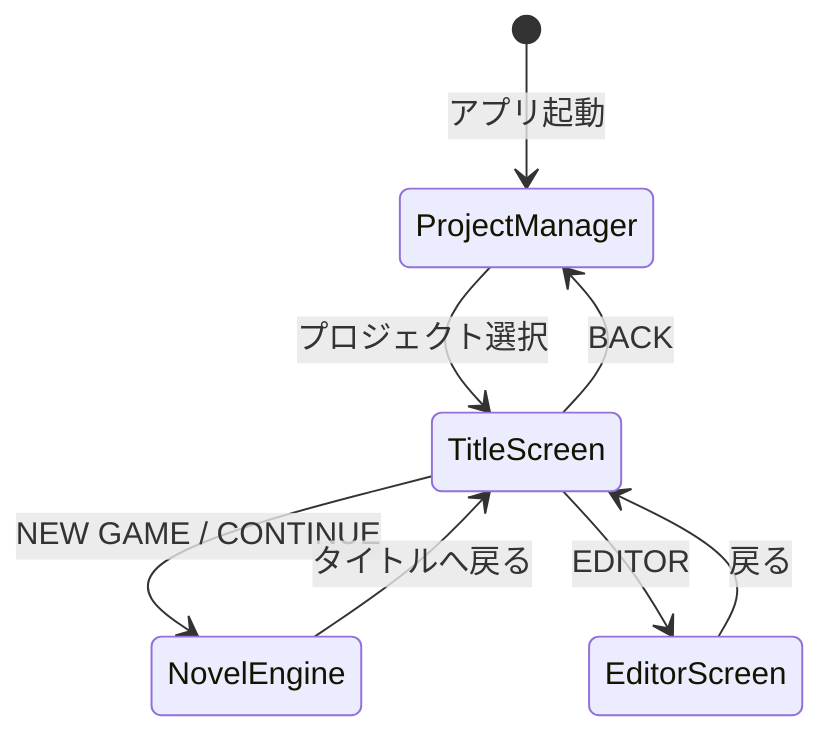
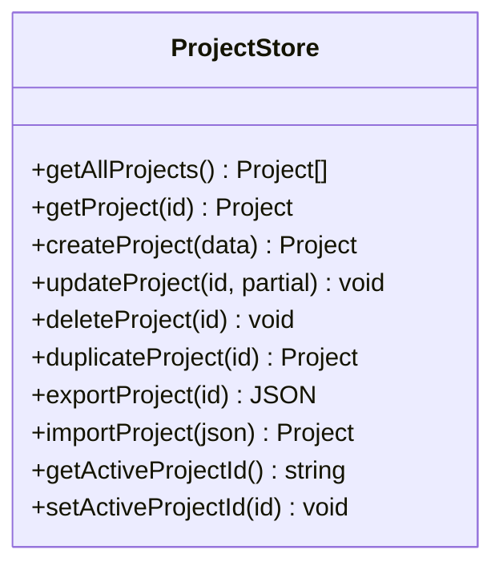
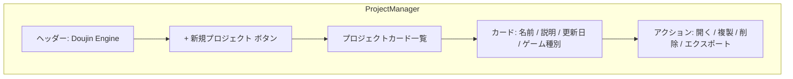
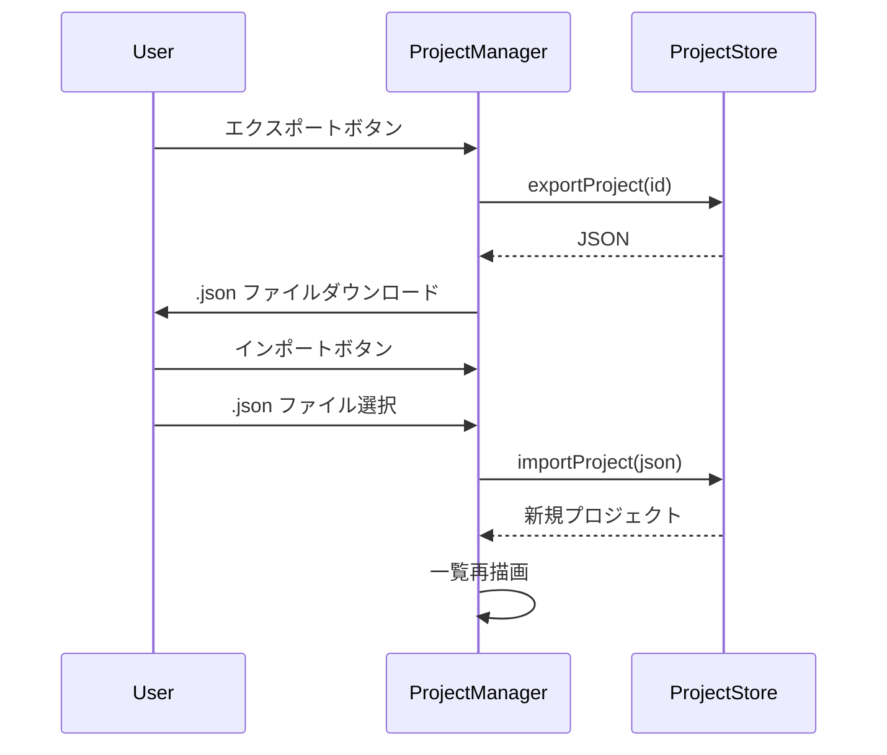

# 設計書: プロジェクト管理

> 対象: 複数プロジェクト管理システム（実装済み部分の仕様化 + 拡張）

## 1. 概要

複数の同人ゲームプロジェクトを作成・管理し、それぞれ独立したスクリプト・キャラ・背景・セーブデータを持つ。

---

## 2. 画面遷移



---

## 3. プロジェクトデータ構造

```js
{
  id: "proj_1710000000000",
  name: "桜の放課後",
  description: "学園ノベル第1作",
  createdAt: "2026-03-15T10:00:00.000Z",
  updatedAt: "2026-03-20T15:30:00.000Z",
  gameType: "novel",           // "novel" | "rpg" | "minigame"

  // ノベル固有
  script: [...],
  characters: {...},
  bgStyles: {...},

  // RPG 固有（gameType: "rpg" 時）
  maps: [...],
  enemies: [...],
  skills: [...],
  battleConfig: {...},

  // ミニゲーム固有（gameType: "minigame" 時）
  minigameType: "quiz",
  minigameConfig: {...},

  // 共通
  saves: [null, null, null, null],
  config: {
    resolution: { width: 1920, height: 1080 },
    textSpeed: 40,
    volumes: { master: 1.0, bgm: 0.8, se: 1.0 },
  },
}
```

---

## 4. ProjectStore API



### ストレージ

| 環境 | 保存先 | キー |
|------|--------|------|
| ブラウザ | localStorage | `doujin-engine-projects` |
| Electron | `userData/projects.json` | ファイル |

---

## 5. ProjectManager 画面

### 5.1 レイアウト



### 5.2 新規プロジェクト作成

1. 「新規プロジェクト」ボタンクリック
2. モーダル: プロジェクト名 / 説明 / ゲーム種別 選択
3. ゲーム種別に応じたテンプレートで初期化

### 5.3 エクスポート / インポート



---

## 6. テスト観点

- [ ] プロジェクト作成・削除・複製が正しく動作すること
- [ ] ゲーム種別ごとに正しいテンプレートが適用されること
- [ ] プロジェクト選択後にタイトル画面に遷移すること
- [ ] エクスポートした JSON をインポートして復元できること
- [ ] プロジェクト間でセーブデータが混在しないこと
- [ ] localStorage の容量上限に達した場合のエラーハンドリング
