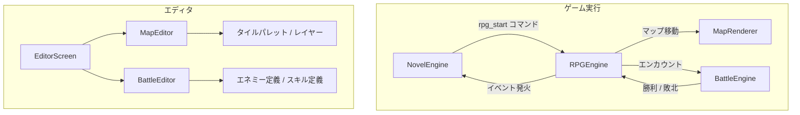
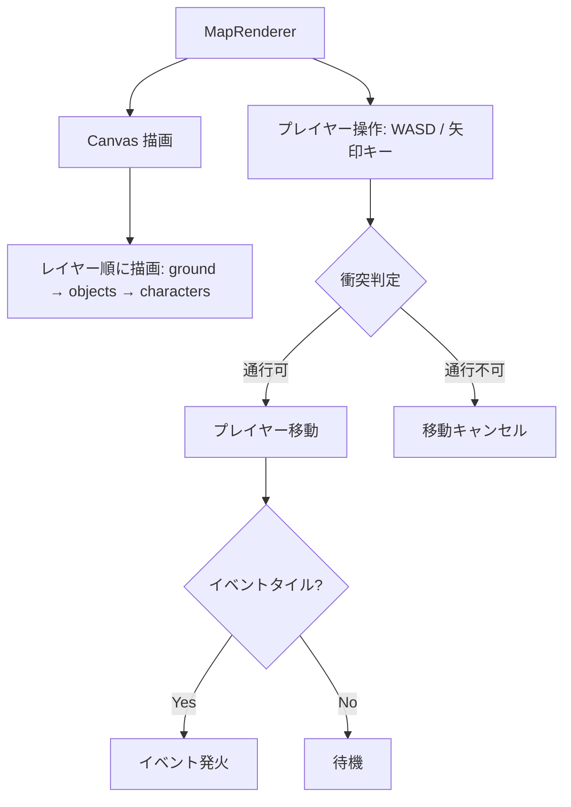
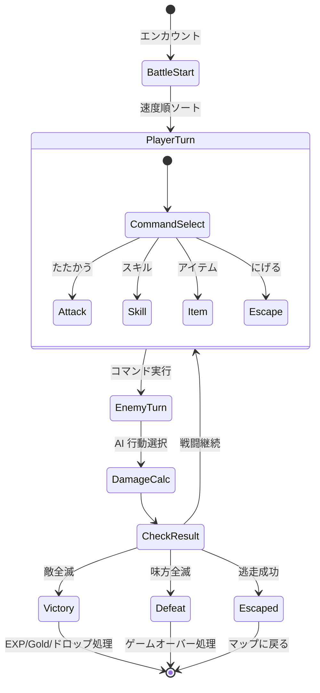
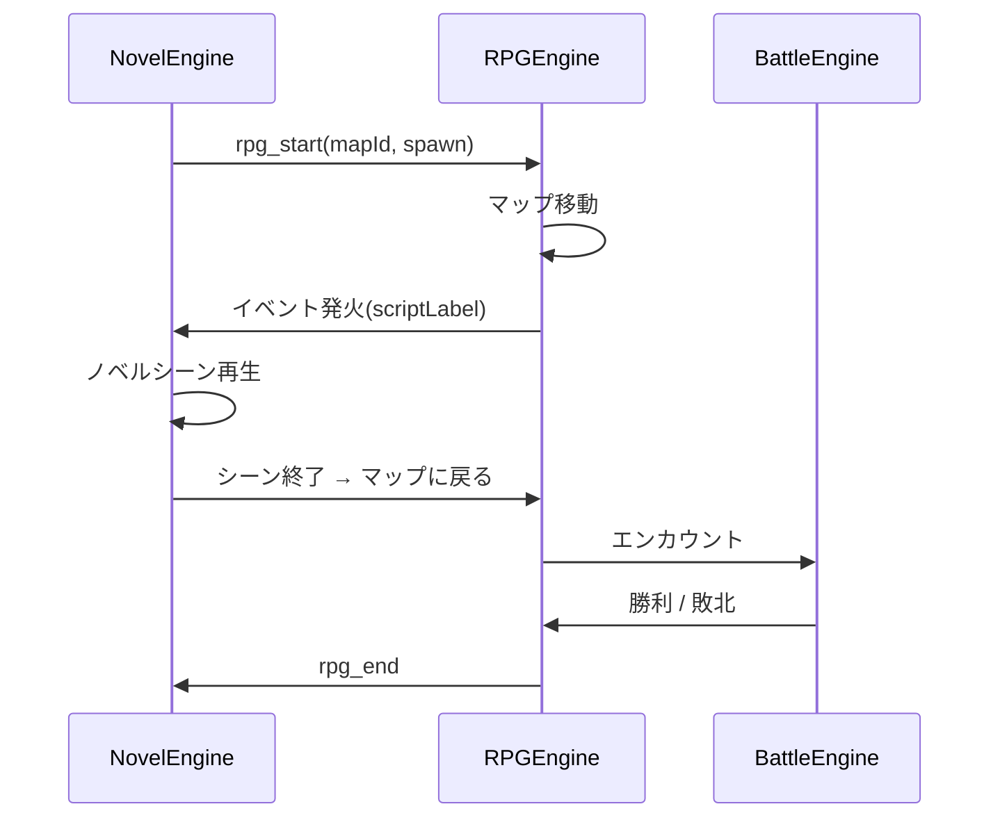
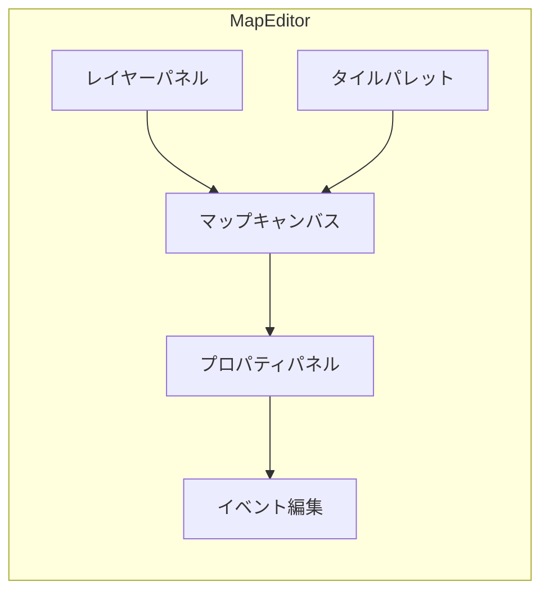

# 設計書: RPG エディタ / エンジン

> 対象: RPG 機能（マップ / バトル / エネミー / スキル）

## 1. 概要

タイルベースの RPG マップ移動と、ターンベースバトルを同人ゲームに組み込めるようにする。
ノベルエンジンとの統合により、RPG パート中にノベルシーンを挿入できる。

---

## 2. 全体構成



---

## 3. マップシステム

### 3.1 マップデータ構造

```js
{
  id: "map_01",
  name: "始まりの村",
  width: 20,           // タイル数（横）
  height: 15,          // タイル数（縦）
  tileSize: 32,        // 1タイルのピクセルサイズ
  layers: [
    { name: "ground",    type: "tile",      data: [0, 0, 1, 1, 2, ...] },
    { name: "objects",   type: "object",    data: [...] },
    { name: "collision", type: "collision", data: [0, 0, 1, 1, 0, ...] },
  ],
  tileset: "village",
  events: [
    {
      id: "ev_01",
      x: 5, y: 3,
      trigger: "action",           // "action" | "touch" | "auto"
      scriptLabel: "scene_village_elder",
    },
  ],
  connections: [
    { direction: "north", targetMap: "map_02", spawnX: 10, spawnY: 14 },
  ],
}
```

### 3.2 MapRenderer フロー



### 3.3 ファイル構成

| ファイル | 内容 |
|---------|------|
| `src/rpg/RPGEngine.jsx` | RPG メインコンポーネント |
| `src/rpg/MapRenderer.jsx` | Canvas ベースのマップ描画 |
| `src/rpg/PlayerController.js` | キー入力 + 衝突判定 |
| `src/rpg/EventManager.js` | マップイベント管理 |

---

## 4. バトルシステム

### 4.1 データ構造

```js
// エネミー定義
{
  id: "slime", name: "スライム",
  hp: 30, attack: 8, defense: 3, speed: 5,
  exp: 10, gold: 5,
  sprite: "enemies/slime.png",
  skills: ["tackle"],
  dropTable: [{ itemId: "herb", rate: 0.3 }],
}

// スキル定義
{
  id: "fire_bolt", name: "ファイアボルト",
  type: "magic",          // "physical" | "magic" | "heal" | "buff" | "debuff"
  power: 25, mpCost: 5,
  target: "single_enemy", // "single_enemy" | "all_enemies" | "self" | "single_ally" | "all_allies"
  element: "fire",
}
```

### 4.2 バトルフロー



### 4.3 ダメージ計算式

```js
function physicalDamage(attacker, defender, skill) {
  const base = attacker.attack + skill.power;
  const damage = Math.max(1, base - defender.defense + randomRange(-3, 3));
  return Math.floor(damage);
}

function magicDamage(attacker, defender, skill) {
  const base = skill.power * 1.5;
  const resist = defender.magicDefense || 0;
  const damage = Math.max(1, base - resist + randomRange(-2, 2));
  return Math.floor(damage);
}
```

### 4.4 ファイル構成

| ファイル | 内容 |
|---------|------|
| `src/rpg/BattleEngine.jsx` | バトル画面 + ターン管理 |
| `src/rpg/BattleCalc.js` | ダメージ計算 + 命中判定 |
| `src/rpg/BattleAI.js` | 敵 AI |
| `src/rpg/BattleUI.jsx` | HP バー / コマンドメニュー / ログ |

---

## 5. ノベル ↔ RPG 統合

### 5.1 新コマンド

```js
{ type: "rpg_start", mapId: "map_01", spawnX: 10, spawnY: 8 }
{ type: "rpg_end" }
{ type: "battle_start", enemies: ["slime", "slime", "goblin"] }
```

### 5.2 統合フロー



---

## 6. MapEditor（エディタ）

### 6.1 機能一覧

| 機能 | 説明 |
|------|------|
| タイルパレット | タイルセット画像からタイル選択 |
| レイヤー切替 | ground / objects / collision を個別編集 |
| 塗りつぶし | flood fill アルゴリズム |
| 矩形選択 | 範囲選択 → コピー / ペースト |
| イベント配置 | マップ上にイベントマーカーを配置 |
| マップ接続 | 隣接マップとの接続設定 |
| テストプレイ | エディタ内でマップを歩ける |

### 6.2 レイアウト



---

## 7. BattleEditor（エディタ）

| タブ | 内容 |
|------|------|
| エネミー | エネミー定義の CRUD |
| スキル | スキル定義の CRUD |
| エンカウント | マップごとの出現テーブル |
| バランス | ダメージシミュレータ |

---

## 8. テスト観点

- [ ] マップが正しくタイル描画されること
- [ ] WASD / 矢印キーでプレイヤーが移動すること
- [ ] 衝突タイルで移動がブロックされること
- [ ] マップイベントが正しく発火すること
- [ ] バトルのターン順が速度順であること
- [ ] ダメージ計算が仕様通りであること
- [ ] 逃走判定が確率に基づくこと
- [ ] ノベル → RPG → バトル → ノベルの遷移が正しく動作すること
- [ ] MapEditor でタイルの配置・削除ができること
- [ ] BattleEditor でエネミー定義の追加・編集ができること
