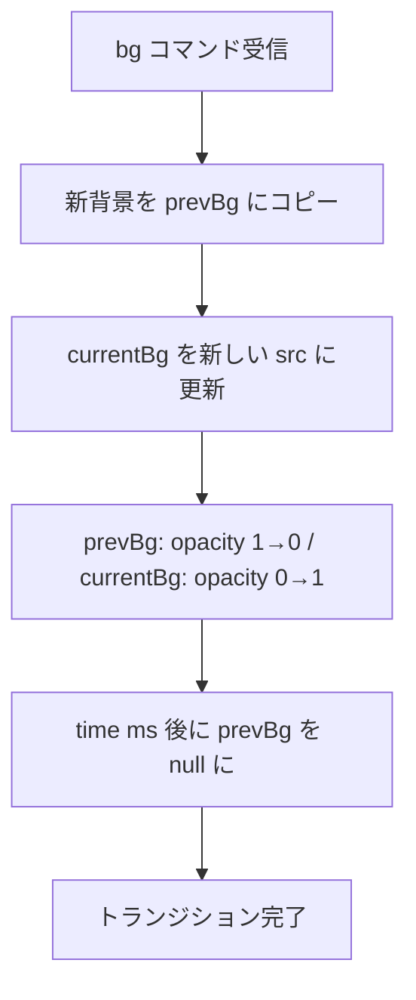
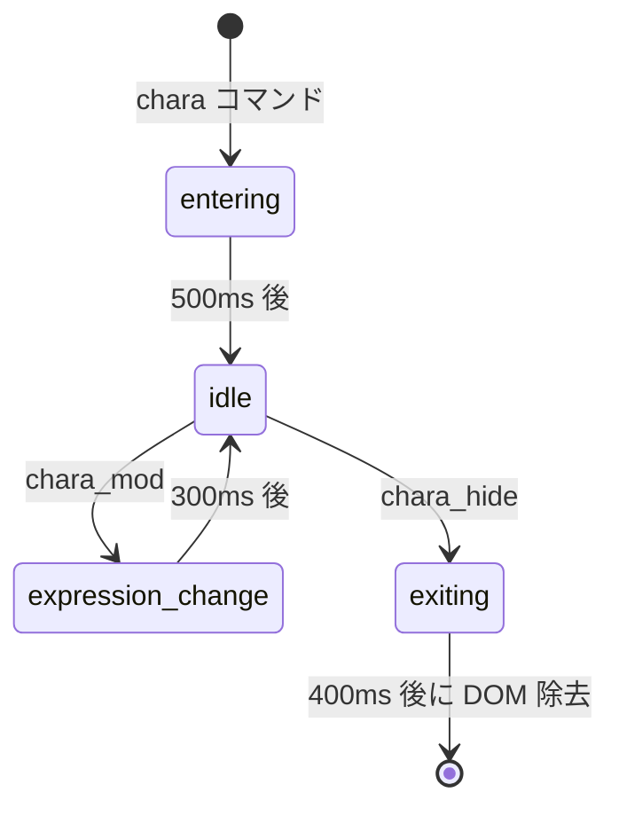

# 設計書: トランジション / キャラアニメーション

> 対象: E-016, E-017

## 1. 概要

背景切り替え時のトランジション種類を拡張し、
キャラクターの登場・退場・表情変更にアニメーションを追加する。

---

## 2. トランジション一覧

### 2.1 背景トランジション

| name | 説明 | 実装方式 |
|------|------|---------|
| `none` | 即座に切替 | opacity 1→1 |
| `fade` | フェード（既存） | opacity 遷移 |
| `crossfade` | 新旧背景を重ねてフェード | 2枚の div を z-index + opacity 制御 |
| `wipe_left` | 左からワイプ | clip-path: inset() アニメーション |
| `wipe_right` | 右からワイプ | 同上（方向逆） |
| `slide_left` | 左へスライド | transform: translateX アニメーション |
| `slide_right` | 右へスライド | 同上（方向逆） |

### 2.2 コマンド例

```js
{ type: "bg", src: "classroom", transition: "crossfade", time: 1200 }
{ type: "bg", src: "rooftop", transition: "wipe_left", time: 800 }
```

---

## 3. crossfade 実装設計



### ステート追加

```js
// reducer.js
prevBg: null,
bgTransitionType: "fade",
bgTransitionTime: 800,
```

---

## 4. wipe / slide 実装

### wipe

```css
.wipe-left {
  clip-path: inset(0 100% 0 0);
  animation: wipeLeft 800ms ease-out forwards;
}
@keyframes wipeLeft {
  to { clip-path: inset(0 0 0 0); }
}
```

### slide

```css
.slide-container {
  display: flex;
  width: 200%;
  animation: slideLeft 800ms ease-out forwards;
}
@keyframes slideLeft {
  from { transform: translateX(0); }
  to   { transform: translateX(-50%); }
}
```

---

## 5. キャラアニメーション

### 5.1 アニメーション種類

| アクション | アニメーション | CSS |
|-----------|-------------|-----|
| `chara` 登場 | 下からフェードイン | translateY(30px) + opacity 0→1 |
| `chara_hide` 退場 | フェードアウト | opacity 1→0 |
| `chara_mod` 表情変更 | 軽い揺れ | translateX を 2px 振動 |

### 5.2 ステートマシン



### 5.3 ステート設計

```js
characters: {
  sakura: {
    position: "center",
    expression: "smile",
    animState: "idle",  // "entering" | "idle" | "exiting" | "expression_change"
  }
}
```

### 5.4 reducer 変更

```js
case "SET_CHARA":
  return { ...state, characters: {
    ...state.characters,
    [action.payload.id]: { ...action.payload, animState: "entering" },
  }};

case "CHARA_ANIM_DONE":
  if (!state.characters[action.payload]) return state;
  return { ...state, characters: {
    ...state.characters,
    [action.payload]: { ...state.characters[action.payload], animState: "idle" },
  }};

case "REMOVE_CHARA":
  // 即削除ではなく animState: "exiting" に変更
  if (!state.characters[action.payload]) return state;
  return { ...state, characters: {
    ...state.characters,
    [action.payload]: { ...state.characters[action.payload], animState: "exiting" },
  }};

case "REMOVE_CHARA_DONE":
  const remaining = { ...state.characters };
  delete remaining[action.payload];
  return { ...state, characters: remaining };
```

---

## 6. 変更ファイルまとめ

| ファイル | 変更内容 |
|---------|---------|
| `reducer.js` | `prevBg`, `bgTransitionType`, `bgTransitionTime`, キャラ `animState` |
| `commands.js` | bg コマンドに transition / time パラメータ処理追加 |
| `Background.jsx` | crossfade 用 2枚重ね + wipe/slide 対応 |
| `Character.jsx` | animState に応じたアニメーション CSS 適用 |
| `NovelEngine.jsx` | キャラ退場タイマー管理 |

---

## 7. テスト観点

- [ ] fade: 既存の動作が壊れないこと
- [ ] crossfade: 前背景がフェードアウトしながら新背景がフェードインすること
- [ ] wipe_left / wipe_right: 方向が正しいこと
- [ ] slide_left / slide_right: スライドアニメーションが滑らかなこと
- [ ] time パラメータで遷移時間が変わること
- [ ] キャラ登場アニメーションが再生されること
- [ ] キャラ退場アニメーション後に DOM から除去されること
- [ ] 表情変更時に軽いリアクションがあること
- [ ] 高速スキップ中にアニメーションが溜まらないこと
